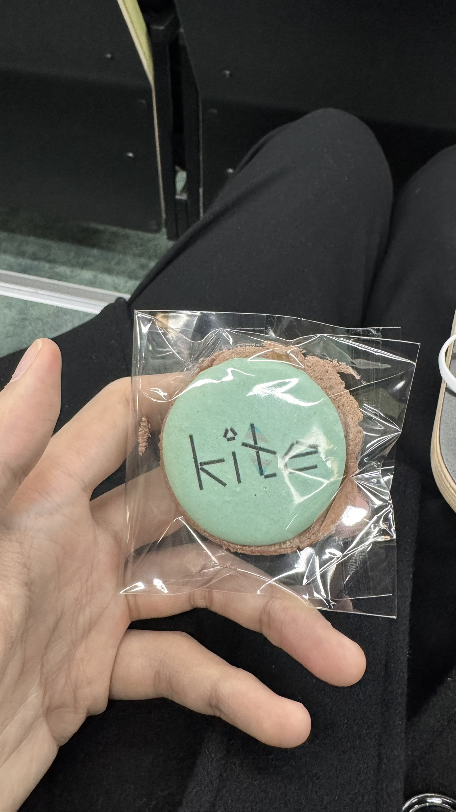
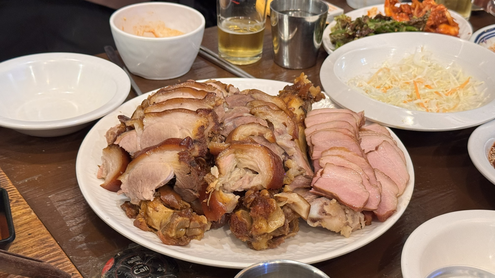
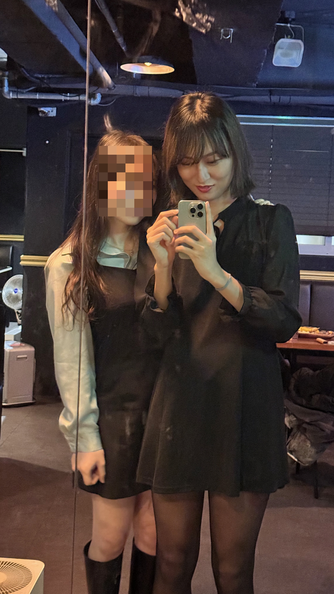
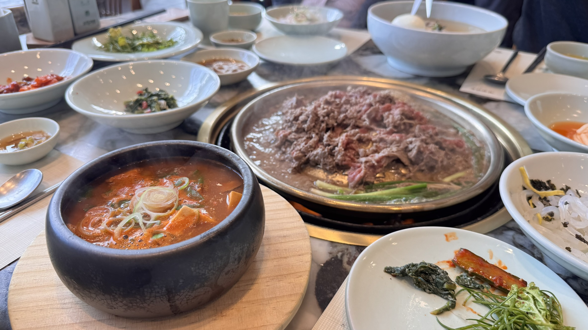
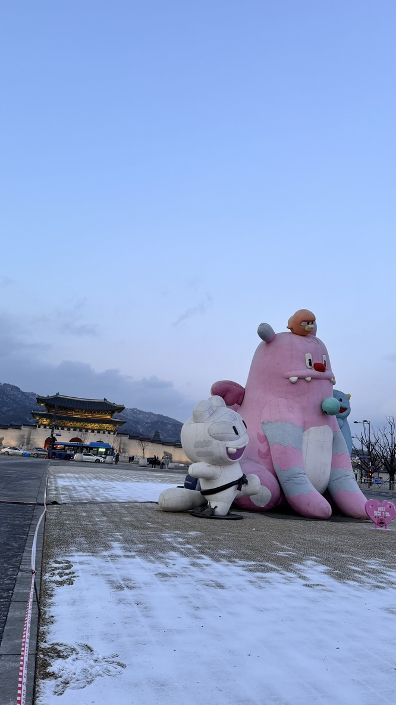

## Triggered by the Event

2025년 1월 18일 강동성심병원에서는 성별확정수술 세미나와 KITE (Korean Initiative for Transgender Health) 의 트랜스젠더 코호트 연구 조사 발표가 있었다.
나는 성별확정수술에 관심이 있었고 호르몬 치료하는 병원에서 KITE 연구를 진행해서 참여하고 있었다.
막상 결과는 알 것 같으면서도 다른 사람들은 어떻게 정체화하고 자신의 신체를 어떻게 변화시키고 있는지 궁금했다.
나는 내가 트랜스젠더임을 정체화했지만 다른 트랜스젠더들을 만나본 적이 없다.
세미나의 주제 특성상 많은 트랜스젠더들이 참여했고 의료진 역시 많이 보였다.

{: width="700" height="400" }
_KITE에서 준비한 마카롱_

한편으로는 내가 여기 있어도 되나? 하는 생각이 들었다.
부모님과 같이 온 사람들도 많이 보였고 혼자 혹은 같이 온 사람들도 보였다.
나는 혼자였다.
쉬는 시간에 밖에서 커피를 홀짝홀짝 마시고 있는데 다른 사람들과 이야기를 하게 되었다.
나의 진짜 정체성을 남에게 보이고 편하게 대화하다 보니 친해졌다.
세미나가 끝나고 다같이 저녁을 먹으러 갔다.

그 전에 세미나에서 어떤 내용을 들었는지 정리해보았다.

* 연령이나 성별을 떠나서 성별 불쾌감을 처음으로 느낀 시기는 평균 12세.
* 성전환증 진단 평균 연령 20세, 호르몬 치료 시작 나이는 평균 24세.
* 평생동안 자살을 생각해본 비율과 자살을 시도한 비율은 70%
* 성별확정치료시 자살 사고가 30%로 감소.

나는 정신건강적으로 건강하다고 생각했고 자살생각을 해본 적이 없어서 다행이라고 생각했다.
그리고 치료나 진단 시점을 생각해봤을 때 조금 늦었지만 땅을 치고 후회할 정도라고 생각하지 않았다.
오히려 지금이라도 생각해보고 정체화할 수 있게 되어서 다행이라고 생각했다.
나는 나대로 살고 싶었다.

세미나에서 알게 된 사람들과 저녁을 먹으러갔다.

저녁은 족발이었다!

{: width="700" height="400" }
_저녁으로 먹은 족발!_

모인 사람들은 모두 MTF (Male to Female) 트랜스젠더였다.
서로 어떻게 정체화하게 되었는지, 목표는 무엇인지에 대해 이야기를 나눴다.
보통 나는 처음보는 사람들과는 낯을 많이 가리고 불편해한다.
하지만 다들 솔직했고 나도 편하게 말할 수 있는 분위기여서 쉽게 친해졌다.
밥을 다 먹고 뒷풀이로 말로만 듣던 CD바? 라는 곳에 갔다.
CD바는 여장하고 술마시는 공간이라고 들었다.
사실 나에게 여장이라는 건 정체성의 표현 중 하나라고 생각했다.
그렇지만 단 한번도 남에게 보인 적이 없었고 억지로 하고 싶은 생각도 없었다.
이번 기회에 먼가 해보고 싶었다.
화장도 받아보고 원피스도 입어봤다.
다들 예쁘다고 해줘서 용기가 생겼던 것 같다.

{: width="400" height="700" }
_이런 나의 모습을 찍어보는 것도 처음이다_

이 날의 경험이 뭔가 트리거가 되었다.
부모님에게도 말해야겠다고 생각하게 되었다.
그렇지 않으면 나는 내가 원하는대로 살 수 없을 것 같았다.

## 1월 18일 이후
1월 19일은 부모님의 결혼기념일이었다.
삼원가든에서 가족과 간만의 근사한 식사를 했다.
{: width="700" height="400" }
_불고기와 된장찌개가 맛있었다_

식사를 마치고 나는 전날의 여운을 느꼈다.
내가 온전히 받아들여지고 내가 생각하는 것을 거짓없이 솔직하게 나눌 수 있었던 시간이다.
내가 행복감을 느낄수록 아이러니하게도 불행해지는 느낌이었다.
부모님께 차마 말할 엄두가 안났다.
그렇게 방에 처박혀서 이불 뒤집어쓰고 주말을 보냈다.
잠을 자는 건지 싶을 정도로 2시간마다 깨고 속도 울렁거렸다.

2025년 1월 22일, 나는 아침 식사를 하기 위해 식탁에 앉았다.
엄마에게 커밍아웃할 생각을 하니까 너무 우울했다.
엄마한테 말하지 않으면 나는 정신과에 가서 우울증을 치료받아야 할 정도였다.
그런 내 모습을 본 엄마가 나한테 먼저 무슨 일이 있냐고 물어봤다.
내가 말을 못하고 있자 엄마가 나를 내 방 침대로 끌고 가서 같이 나란히 앉았다.

나는 한 30분동안 울고 말할지 말지를 고민했다.
그리고 내뱉은 첫 마디는 "내가 남자인게 싫어" 였다.
엄마는 상상도 못했던 이야기라 충격을 받았지만 우선은 나를 달래주려고 한 것 같다.
엄마 나름대로 이해해보려고 홍석천 쪽인지 하리수 쪽인지를 물어보기도 했다.
나는 이왕 말하게 된 거 호르몬 치료도 하고 있고 수술도 받고 여자로 살고 싶다고 했다.
엄마는 미래의 내가 후회하게 되는 것을 가장 걱정했다.
엄마는 나를 최대한 이해해주려고 했고 나를 위로해주었다.

나는 하지 못할 짓을 한 것 같아 슬펐지만 그 동안의 우울했던 것이 금세 사라졌다.
지지나 동의는 아니었지만 위로만으로도 나는 안정을 찾았다.

## 1월 28일
엄마한테 커밍아웃하고 설날 연휴가 다가왔다.
엄마는 아빠한테도 말하라고 했고 나는 언제가 적절할지 타이밍을 보고 있었다.
아빠한테는 울면서 말하면 안될 것 같았기 때문에 서류를 준비했다.
진단서, 심리평가지, 호르몬 혈액 검사지 그리고 예비군 면제 통지서까지 준비했다.
우선 할아버지를 뵈러 대구에 다녀와서 해야겠다고 생각했다.
그리고 1월 28일 오전 할말이 있다고 하고 아빠를 내 방으로 불렀다.
준비한 서류를 보여드렸다.
5분정도 서류를 보셨다.
왜 이렇게 오랜 시간동안 혼자 고민했냐고, 큰일이 아니라면서 괜찮다고 해줬다.
그리고 나를 안아줬다.
분명 당황스럽고 혼란스러웠을텐데 차분하게 말해주셔서 감사했다.

나는 이대로 하루가 지나가면 분위기가 이상할 것 같아서 서울 투어? 를 했다.
{: width="500" height="300" }
_광화문에서_
