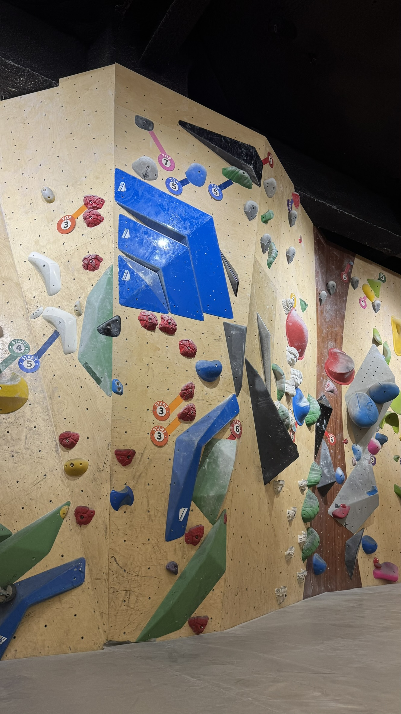
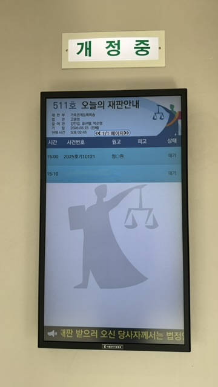
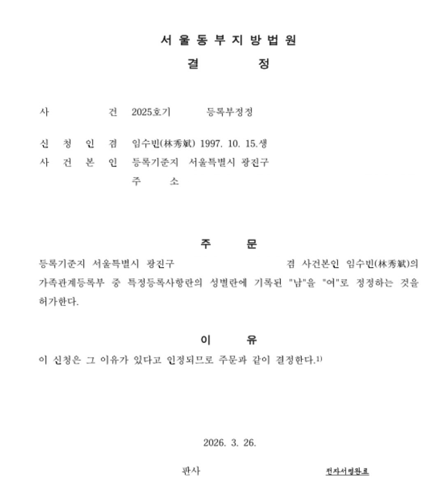

거의 반년 만에 쓰는 포스팅이라 디테일은 별로 없을거다 ㅋㅋㅋㅋ

## 회복
큰 수술로부터의 회복은 꽤 힘이 드는 일이었다.
장기간 거동이 쉽지 않아서 체력과 심폐력이 많이 떨어진 것을 느꼈다.
나는 운동의 필요성을 느꼈고 계속 운동 언제하지 하고 노래를 불렀다.
체력적인 회복과 동시에 일상으로의 회복도 서둘렀다.
Inspire Hep에서 박사 공고를 올라오는 대로 지원했다.
하지만 엄마가 교통사고에서 회복한지 얼마 되지 않아 다시 아파서 간병을 해야했다.
그래서 여러모로 신경써야 할 부분이 많았다.

## 운동
나는 회복하면서 운동할 수 있는 날만을 기다렸다.
수술한 지 2달이 지난 2월부터 방에서 가볍게 운동을 해봤다.
산책 역시 하루에 1 km 씩은 꾸준히 했다.
2월 말에는 드디어 헬스장에 등록했다!
그 와중에 임수빈으로 개명이 완료되었다.

사실 헬스장에 몇 번 안가고, 지금도 안가고 있다 ㅎㅎ...
클라이밍을 다시 하고 싶었다.
친구들과 같이 가서 볼더링 문제 푸는게 재밌기도 하고 성취감도 느껴졌다.
지난 교통사고 이후 클라이밍을 하지 못해서 손목이 많이 안좋은 상태였다.
근력이 필요한 상황이어서 재활삼아 클라이밍을 서서히 시작했다.
<figure>
    
    <figcaption>더클라임 성수! 이번엔 혼자 왔다. 2026.03.21</figcaption>
</figure>

사실 더욱 고민했던 운동은 발레였다.
2023년도부터 약 1년 넘게 발레를 꾸준히 했었다.
다시 시작하려고 보니까 성별도 달라져서 발레 학원에 문의할 때 좀 신경이 쓰였다.
연락했던 어떤 학원에서는 대면 상담 없이 그냥 안된다고 해서 마음에 상처를 입었다.
하지만 지금 다니는 발레 학원에서 개인레슨부터 해서 열정적으로 알려주셔서 재밌게 다니고 있다.
레오타드도 다시 샀다!
<figure>
    
    <figcaption>룰리의 이바나 레오타드. 길어서 맞는 레오타드가 별로 없지만 마음에 드는게 맞아서 좋다.</figcaption>
</figure>

## 성별정정
나는 작년 마지막날에 서울 동부지방법원에 등록부정정을 신청했다.
성별정정은 가족관계등록부의 성별 란을 바꾸는 것으로 된다고 한다.
성별정정을 위해 많은 서류들을 제출했다.
- 성장환경진술서
- 기본증명서
- 주민등록등(초)본
- 정신과 진단서 (성전환증)
- 성전환 수술 후 의사 소견서 및 생식능력에 관한 소견서
- 인우인의 보증서 2부
- 병적증명서
- 혼인관계증명서
- 가족관계증명서
- 부모동의서 (부,모)
- 신용정보조회서
- 출입국사실증명서

다행히도 대한민국은 법원이 전산화되어있어서 모든 절차를 온라인으로 진행했다.
심문기일에만 오프라인 법정에 참석하면 되었다.
나는 신청 후 3달이 지난 2026년 3월 23일에 심문기일이 잡혔다.
<figure>

<figcaption>나에게 할당된 시간은 단 10분이었다.</figcaption>
</figure>

심문은 이름을 부르면서 시작됐다.
내가 하는 일, 했던 일 등을 물어보면서 성장환경진술서와 진위를 대조하는 것 같았다.
판사는 법원장이었는데 나에게 가정을 꾸릴 생각이 있느냐고 물었다.
나는 그렇다고 말했고 가능하면 입양을 통해서 아이를 키우고 싶은 생각도 있다고 말했다.
그렇게 약 4분만에 질의응답을 마치고 나왔다.
약간 허무하기도 했다.

그리고 4일 후 성별정정이 되었다.
<figure>

<figcaption>성별 정정 허가. 2026.03.26</figcaption>
</figure>