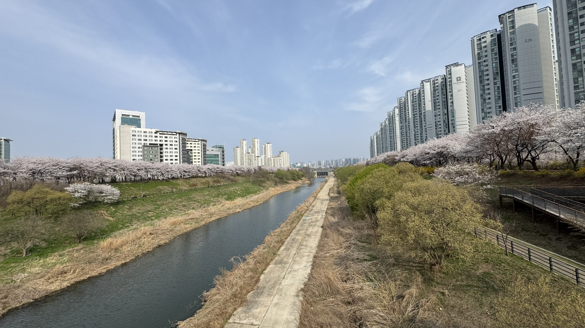
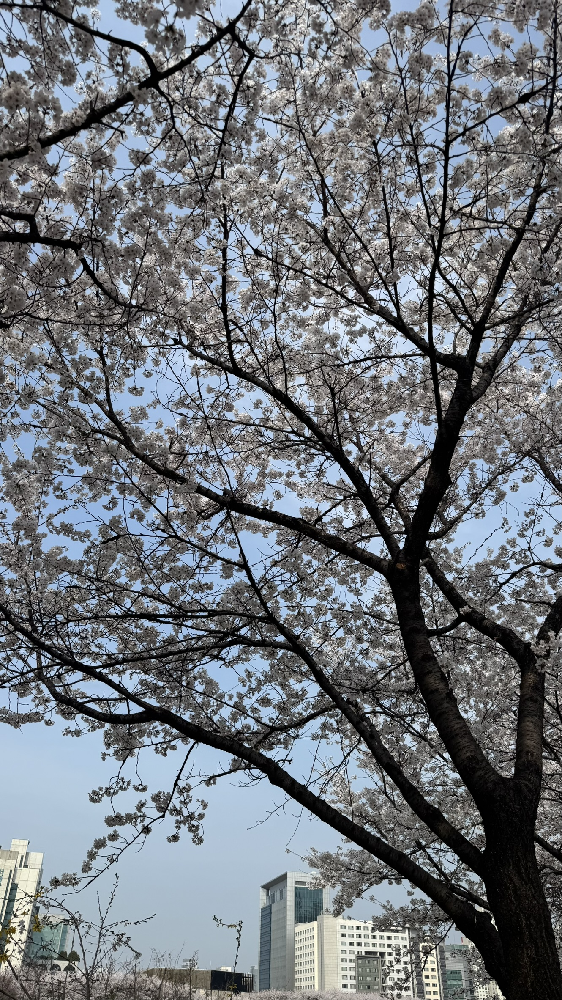
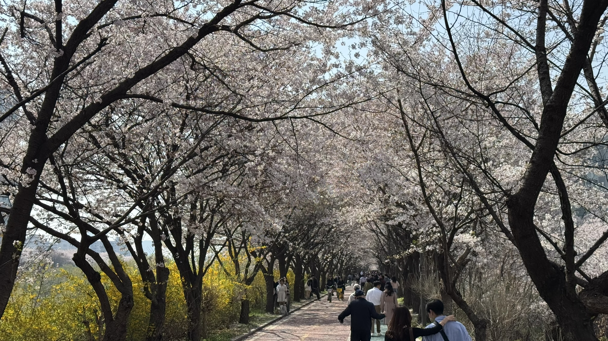
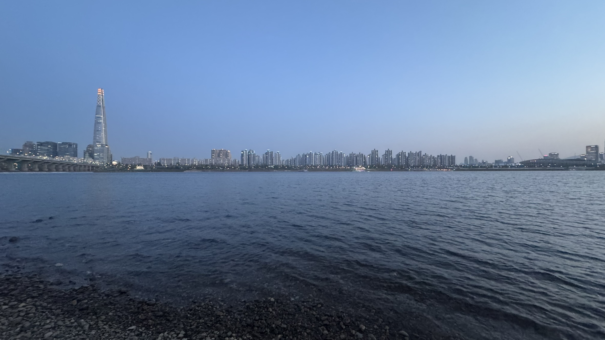
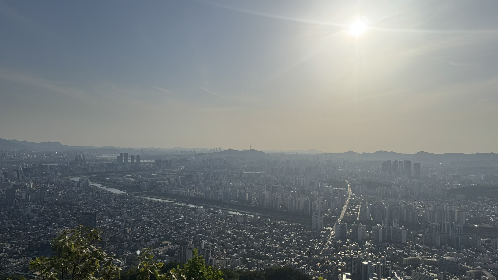
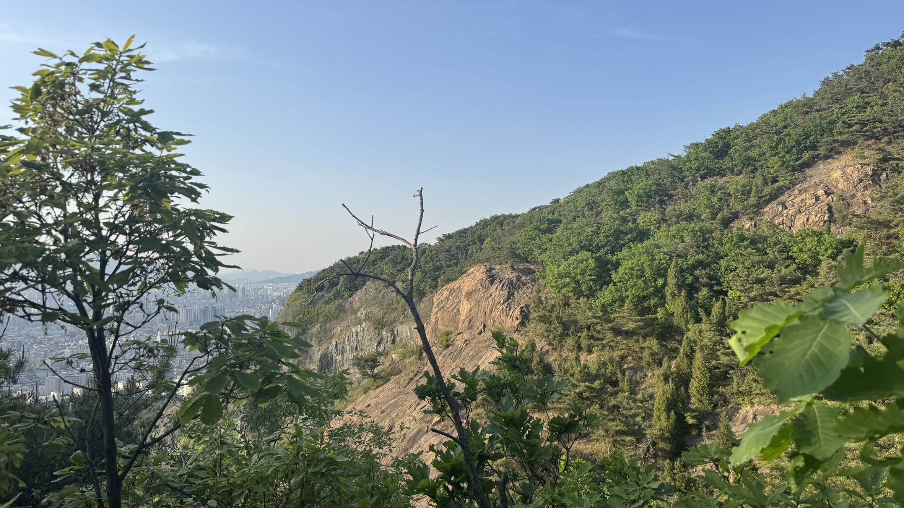
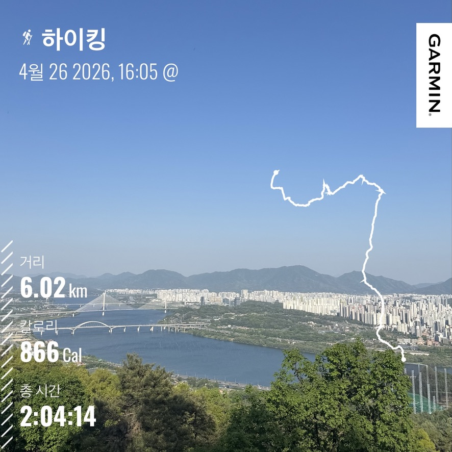
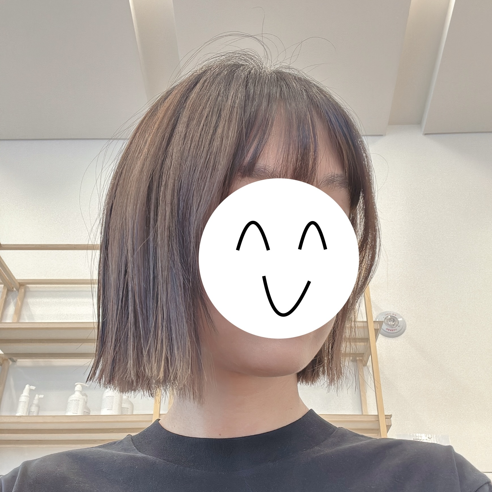
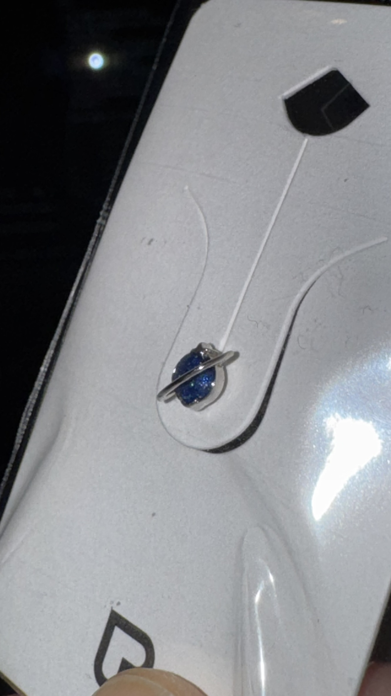

## 개인정보 변경의 늪

성별정정이 허가 된 이후 4월은 개인정보를 변경하느라 바빴다.
가장 먼저 주민등록번호를 새로 발급받아야 했다.
새로운 주민등록번호가 있어야 본인인증이 되기 때문에 가장 필수적이다.
이후에는 통신사와 주 거래 은행의 개인정보를 바꿨다.
본인인증이 주로 휴대전화를 이용해서 진행하기 때문이다.
결제할 때도 오류가 나지 않도록 은행의 개인정보를 변경했다.

카카오와 네이버의 개인 정보도 변경했다.
네이버는 휴대전화 인증으로 한 번에 됐지만, 카카오는 부가 서비스 탈퇴와 서류를 보내야하는 등 귀찮았다.
그래서 알뜰폰으로 새 번호를 받아서 카카오톡 계정을 새로 팠다.

이 정도 되면 꽤 새로운 정보로 살만한 상태가 되었다.
이제부턴 생각나거나 필요한 일이 생길 때마다 개인정보를 변경해주었다.
주식이 중요하기 때문에 증권사 개인정보를 변경해주었다.
작년 사고로 인해 상대 보험사와 우리 측 법무 대리인 쪽에도 변경된 개인정보를 보냈다.
실손 보험이나 병원의 개인정보 역시 변경했다.
한국은 역시 은행이나 정부가 아니라면 대부분 온라인으로 처리가 가능해서 편했다.

여권도 새로운 정보로 갱신했다.
여권에 필요한 증명사진을 찍기 위해 메이크업도 받아봤다.
화장할 때 단계가 이렇게 많은지 몰랐다…

## 벚꽃 시즌
올해는 벚꽃이 좀 빠르게 펴서 개나리랑 함께 보였다.
작년처럼 석촌호수와 성내천에서 벚꽃을 구경했다.

<figure>
    
</figure>
<figure>
    
</figure>
<figure>
    
    <figcaption>성내천 벚꽃 터널. 2026.04.05</figcaption>
</figure>

## 체력 기르기!

4월부터는 발레는 정규반에서 수업을 들었다.
3월에는 개인레슨으로 예전의 기억을 끄집어냈다면, 4월에는 본격적으로 수업에 참여하는 것이다.
레벨 1이라 초반엔 쉬웠지만 4주차로 갈 수록 어려웠다.
특히, 나는 바는 좀 따라갔지만 센터가 많이 약해서 따라가는데 어려움이 있었다.
클라이밍도 매주 친구들과 함께 했는데, 나는 항상 10시에서 11시 쯤 늦게 갔다.
늦게가서 먼저 끝나서 배고프다고 하는게 일이었다. ㅋㅋㅋㅋㅋ

5월부터 수영을 하기 위해서 온라인으로 신청하고 수영복도 샀다. 두근두근
<figure>
    
    <figcaption>수영복 세트를 장만했다! 초심자답지 않게 빨강으로... 2026.04.22</figcaption>
</figure>

그리고 가~~끔 한강 러닝을 가기도 했다.
5키로 30분을 목표로 하지만, 40분 정도 나오는 것 같다.
<figure>
    
    <figcaption>탁 트여있는 한강.</figcaption>
</figure>

등산도 갔다.
워커힐에서 용마산 쪽으로 아차산 능선을 타는 코스였다.
용마산에서 내려가는 길이 꽤 가파라서 조심스러웠다.
<figure>
    
    <figcaption>용마봉에서 본 서울 풍경. 2026.04.26</figcaption>
</figure>

<figure>
    
    <figcaption>용마산 쪽 절벽. 매우 가파르다. 2026.04.26</figcaption>
</figure>

<figure>
    
    <figcaption>새로 산 가민으로 기록!</figcaption>
</figure>

약간 운동에 미쳐서 사는 느낌이지만, 떨어진 체력을 기르기엔 좋았다.

그리고 날씨가 더워져서 갑자기 머리를 자르고 싶어졌다.

아마 제대로 길러보지도 못한 초단기 단발병인 것 같지만... ㅋㅋㅋㅋㅋㅋ

싹둑.
<figure>
    
    <figcaption>단발! 2026.04.15</figcaption>
</figure>

아! 그리고 친구가 피어싱 사줬다.
아직 갈아끼기 겁나서 못끼고 있지만 언젠간!

<figure>
    
    <figcaption>피어싱! 2026.04.04</figcaption>
</figure>

순서가 뒤죽박죽이지만 4월에 있었던 일 정리 끝!