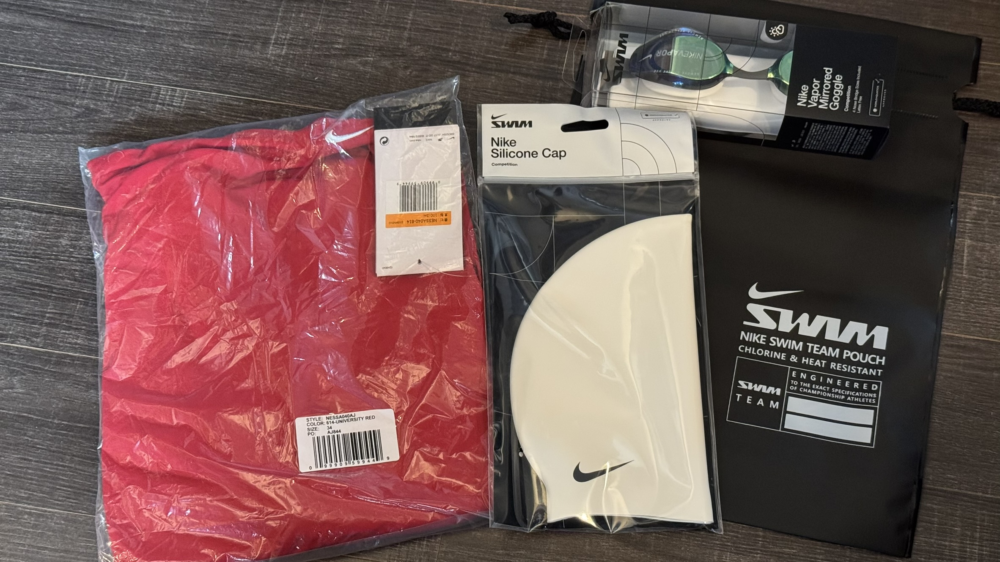
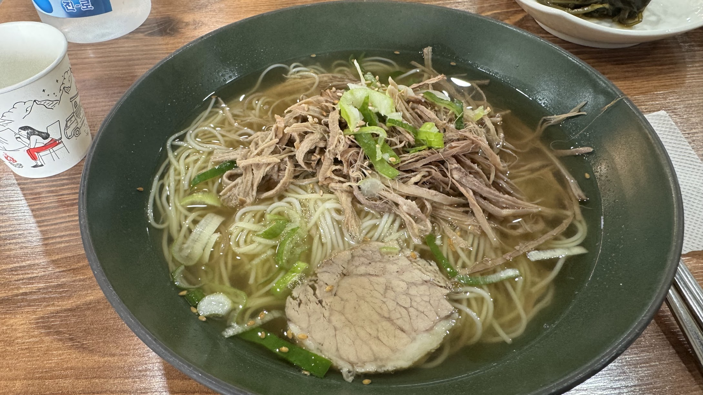
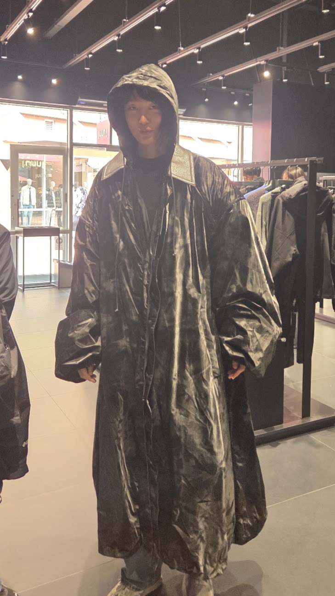
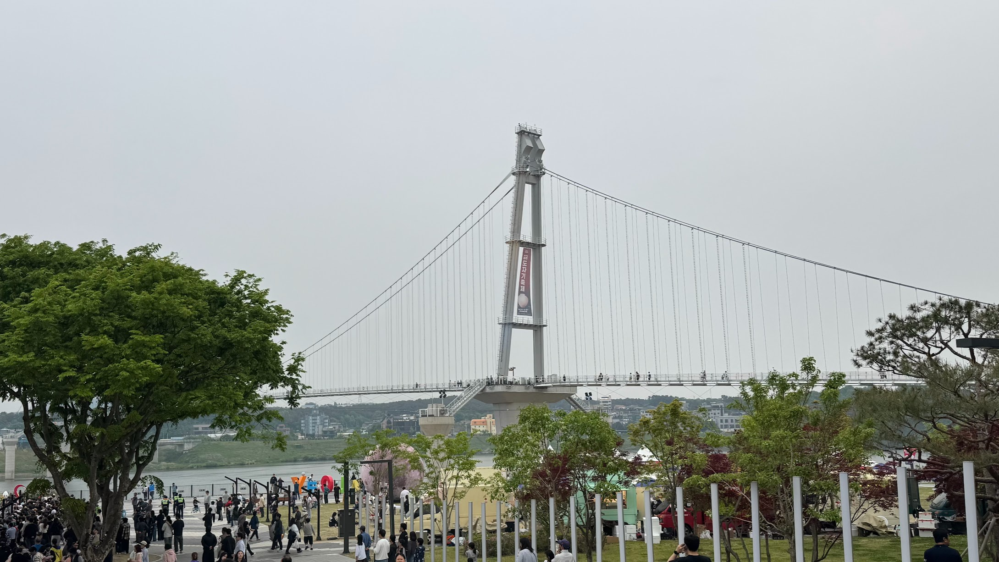
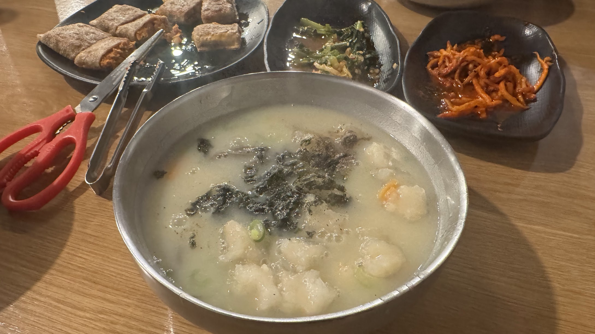
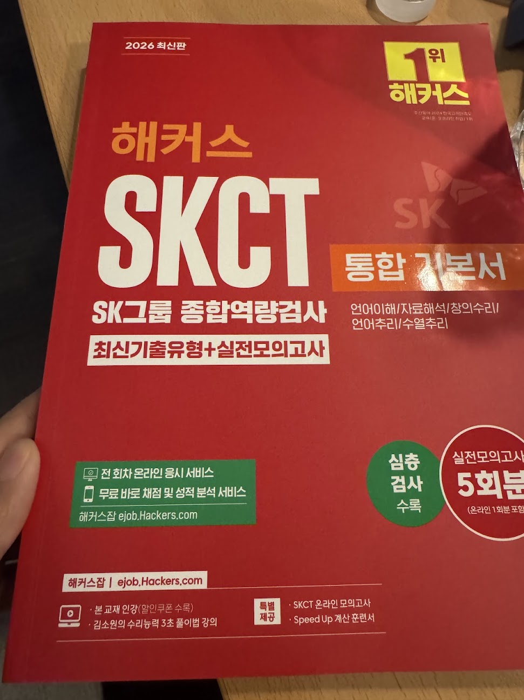
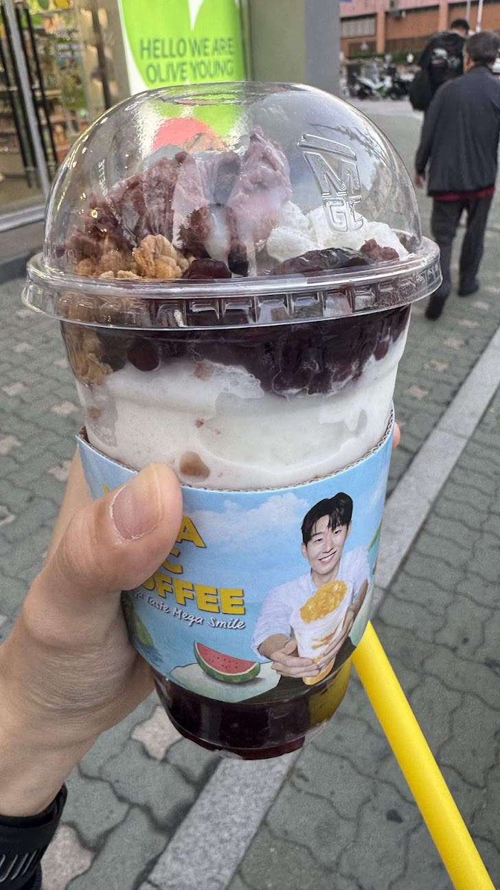
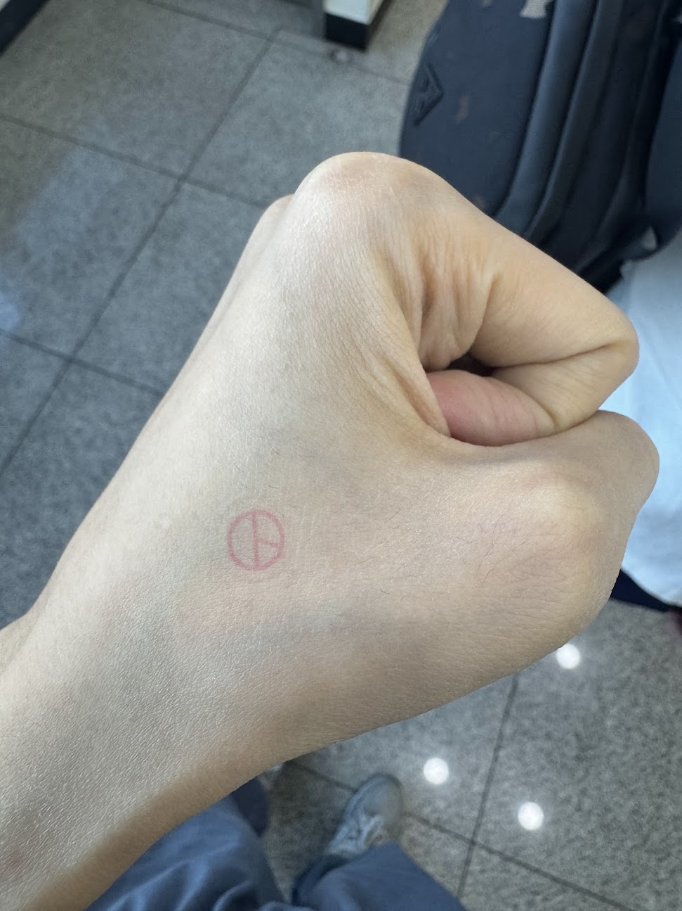

## 용두사미의 5월
5월이 되기 전 계획은 아주 거창했다.
월수금엔 수영을 하고 화목에는 발레를 하며, 주말에는 클라이밍을 하는 계획이었다.
계획을 실천하기 위해 4월 말에 수영을 등록했고 수영복과 수영모, 수경 세트를 구매했다.

<figure>
    
    <figcaption>수영복 세트! 2026.04.22</figcaption>
</figure>

5월이 되고 광진구민체육센터의 수영 개강일에 갔다.
수영장은 오랜만이기도 하고 수술하고 처음이라 떨렸다.
회원카드를 받고 키오스크에 바코드를 찍으니까 탈의실 바코드가 인쇄된 종이를 준다.
인쇄된 종이에는 바코드랑 사물함 번호까지 지정돼서 편했다.
탈의하고 수영복 챙기고 샤워실 들어갔는데 사람이 꽉차있었다...
기다려서 씻고 수영복 입고 나가니까 준비운동 하는 시간이었다.
어떤 대장같은 사람이 처음 온 사람 오라길래 갔는데 여러 필터링을 통해 초급반으로 갔다.
유아풀로 가서 처음엔 킥판 잡고 두 바퀴정도 발차기 연습을 했다.
킥판을 놓고 갈 땐 자유형, 올 땐 배영으로 오라고 해서 하는데 자유형은 그럭저럭 됐는데 배영할 때 물을 왕창 마셔버렸다.
허우적대는걸 봤는지 배영 못하면 자유형으로 왕복하라고 했다.
한 30분 하니까 어지러워져서 걸터앉아서 쉬었다.
끝날 때는 물 속에서 한 바퀴 걷고 끝났다.
샤워실 들어가니까 또 사람들이 바글바글하고 기다리는 사람들도 많았다.
어지러운데 기다리려니까 힘들었다.

그런데 이렇게 월수금을 수강하는 거였는데, 너무 어지러워져서 2주 정도밖에 못들었다.
수영 안가는날에도 어지러워서 이비인후과에서 어지럼증 테스트를 했다.
어지럼증을 유발하는 테스트라 검사하고 나서 토를 하지 않을 수 없었다.
수영을 중단하면서 멀미약을 한 2주 정도 먹고 괜찮아진 것 같다.
수영복 세트는 아깝지만, 좋은 경험이었다.

## 여주 여행
친구가 여주에 사는데 가본다 하고 안간지 n년째라 옷 쇼핑할 겸 갔다.
지하철타고 가는데 2시간 좀 더 걸린 것 같다.
이걸 매일 통학하느라 힘들었을 것 같다.
세종대왕릉역에 도착하니까 친구가 차에서 기다리고 있었다.
점심으로는 고기국수를 먹었다.

<figure>
    
    <figcaption>고기국수 냠. 2026.05.02</figcaption>
</figure>

그리고 간 곳은 여주아울렛이었다.
여러 매장을 돌아다니면서 옷을 입어봤다.
<figure>
    
    <figcaption>엄청 거대한 옷이었다. 가격도 거대한... 2026.05.02</figcaption>
</figure>

그렇게 아울렛을 돌아다니다가 어디서 츄러스 냄새가 났다.
참을 수 없어서 츄러스를 사서 서서 먹었다.
다음 목적지로 가기 전에 스타벅스에서 시원한 음료수를 마시며 조금 쉬었다.
다음 목적지는 여주도자기축제였다.
도자기로 유명한 건 알고 있었지만, 도자기축제는 처음이었다.

<figure>
    
    <figcaption>그릇 색이 예뻤다. 2026.05.02</figcaption>
</figure>

도자기 공방들에서 자신들이 제작한 도자기 그릇들을 전시했다.
자취했다면 여기서 그릇들을 많이 샀을 것 같다.

<figure>
    
    <figcaption>남한강에서 하는 도자기축제. 도자기축제에는 사람들이 많았다. 2026.05.02</figcaption>
</figure>

저녁으로는 감자옹심이를 먹었다.
들깨 국물에 쫄깃한 감자옹심이가 맛있었다.

<figure>
    
    <figcaption>감자옹심이와 메밀전병. 2026.05.02</figcaption>
</figure>

먹고 집에 갈 때가 되니까 갈 길이 막막했다.
집에 도착하면 10시가 넘는 시간이었다.
지하철을 아무리 타도 끝이 보이지 않았다.
집에 도착하자마자 뻗었다. ㅋㅋㅋㅋ

## 준비
4월에 SK AX 에서 하는 SKALA 와 삼성에서 하는 SSAFY 에 지원했다.
박사 과정에 실패할 것을 대비해서 플랜 b로 세워둔 것이다.
SKALA 와 SSAFY 모두 서류에서 통과해서 SKCT 와 SSAFY 논리테스트를 준비했다.

<figure>
    
    <figcaption>SKCT 를 준비하기 위해 책도 샀다. 2026.05.21</figcaption>
</figure>

5월에 SKCT 와 SSAFY 논리테스트가 있었다.
SKCT 는 불행히도 모니터 조작을 하다가 부정행위로 감지되어 로그인이 막혀서 응시하지도 못했다.
SSAFY 논리테스트는 윈도우에서만 된다고 해서 엄마 노트북으로 응시했다.
SSAFY 는 인터뷰 대상자로 선정돼서 6월에 면접을 볼 예정이다.
KIT 박사과정도 Stage 1,2 를 통과해서 3단계인 면접도 6월로 예정되어있다.
잘되면 좋겠다...

점점 더워지는 날씨에 메가커피에서 파는 컵빙이 궁금해졌다.
알바들이 주문 받는걸 꺼려한다는 그 팥빙컵빙이다.
<figure>
    
    <figcaption>그냥 팥빙수 맛이다. 컵으로 돼있어서 돌아다니면서 먹기 편했다. 2026.05.21</figcaption>
</figure>

민주시민으로서 지방선거 사전투표도 완료했다.
<figure>
    
    <figcaption>지방선거 사전투표. 2026.05.29</figcaption>
</figure>

어지럼증 때문에 절반은 날린 것 같은 한 달이었다.
수영은 금지당했고 클라이밍이랑 발레나 계속 하기로 했다.

**이렇게 5월도 끝!**