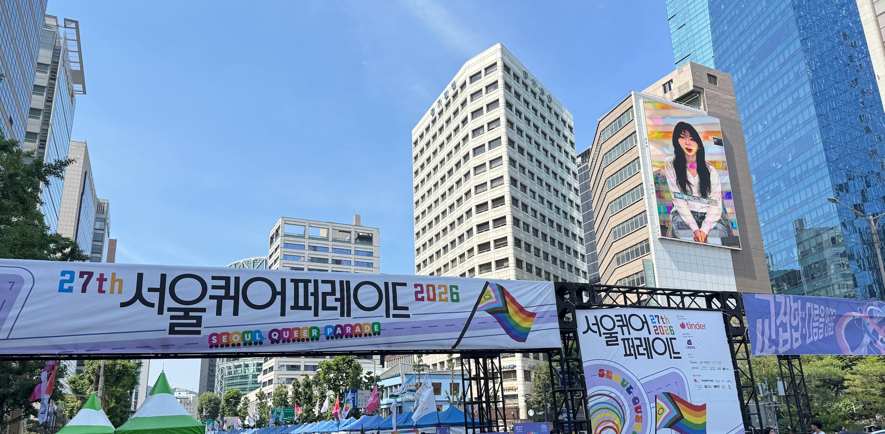
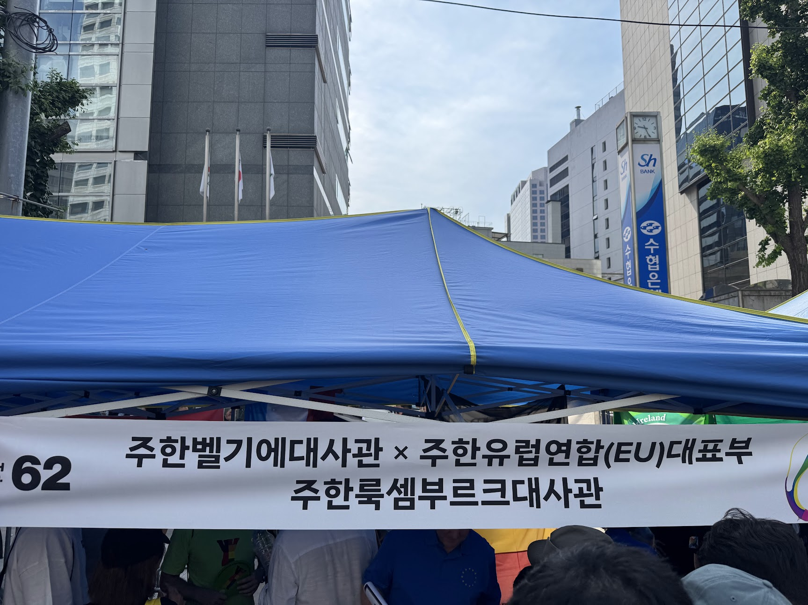
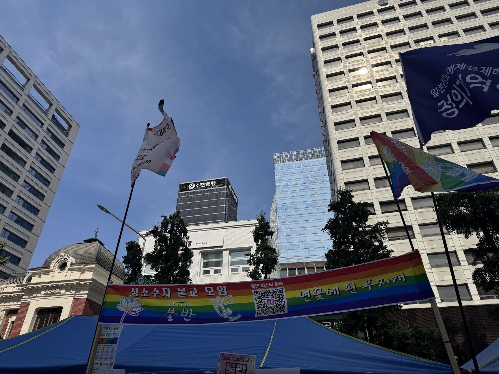
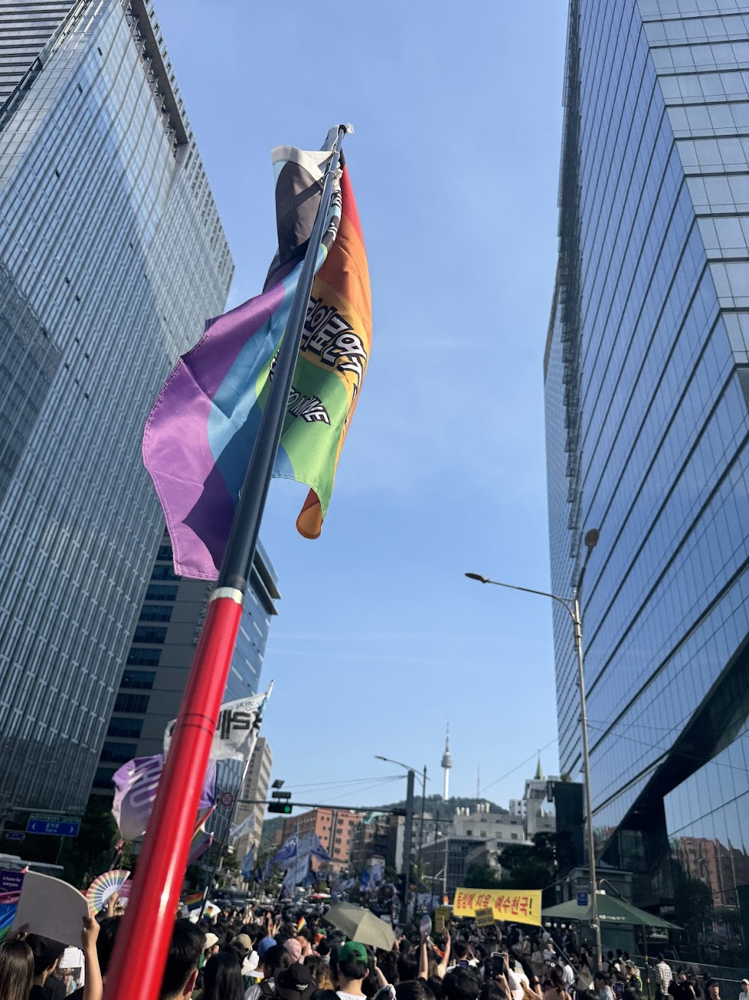
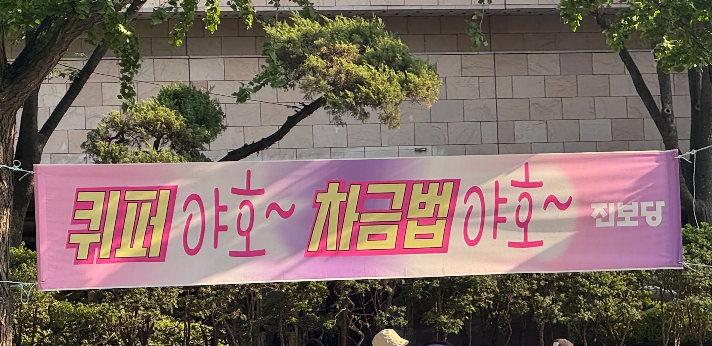
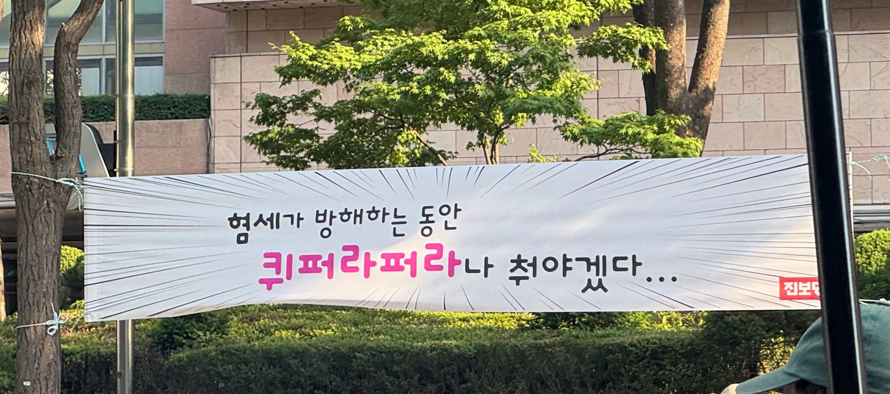
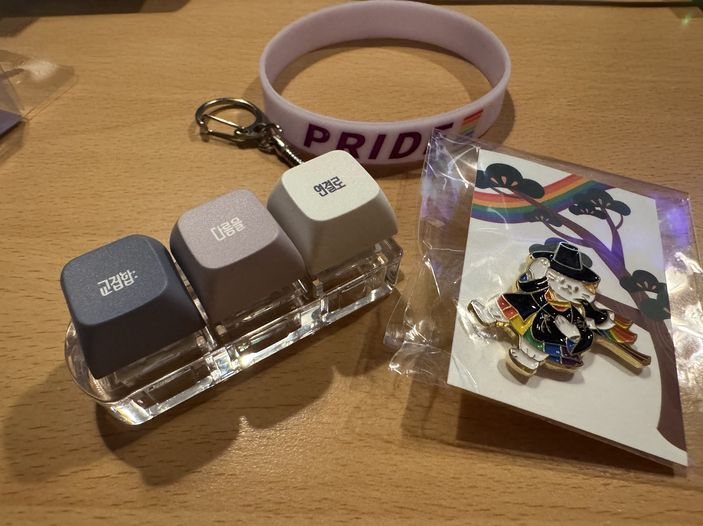
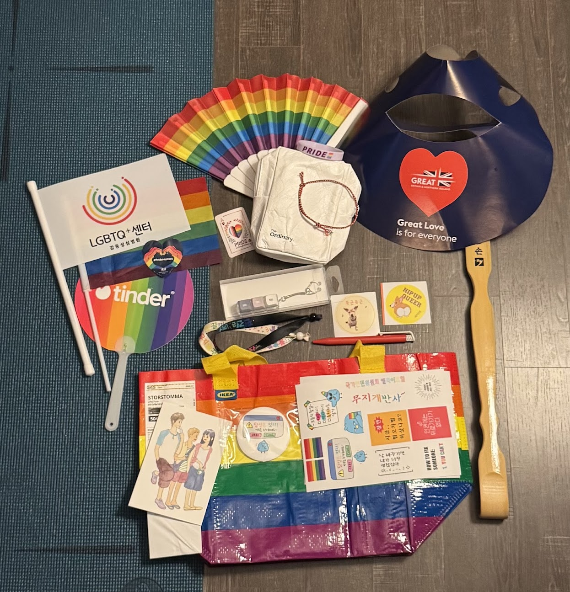

## 6월의 시작은 발레

5월 말 2주동안 어지럼증으로 고생했다.
멀미약을 2주동안 먹고 어지럼증이 조금 괜찮아져서 발레를 다시 갔다.
근데 또 욕심은 있어서 발레도 조금 어려운 반을 들어보기로 했다.
기존에는 레벨 1을 들었는데 레벨 1.5 준비반을 주 1회 듣기로 했다.
첫 레벨 1.5 준비반 수업을 갔을 때는 꽤 당황했다.
매트가 없는 수업이라고는 못들어서 매트 피고 준비하고 있었는데, 수업 시작하자마자 바를 옮기라고 했다.
그리고 순서를 바로 알려주시는데 레벨 1에 비해서 너무 어려웠다.
우선 빠른것도 빠른거지만 바를 하다가 한 바퀴를 돌기도 했다. (플립플락이라는...)
머리로 이해하지 못하면 몸이 안움직였다.
이전에 발레를 1년 반정도 했을 때 거의 마지막즈음에 폴드브라 (발레 팔)를 바에서 했던 기억이 있다.
하지만 다 까먹어버렸다...

센터는 더더욱 가관이었다.
지금 와서야 알지만, 크로아제, 앙파쎄, 에파쎄 등 다양한 방향이 있었는데 별 다른 설명 없이 바로 진행하는 것이었다.
나는 센터를 진짜 못하기 때문에 거의 서있다가 왔다.
발레 잘 못해서 쪽팔리기도 하고 레벨 1에서 보다도 운동이 안되는 느낌이었다.

그래서 내린 결론은...
레벨 1에서 있기에는 순서가 너무 단조롭고 새로 오는 사람들에 집중하다보니 쉬운 느낌이었다.
하지만 레벨 1.5 준비반에서는 레벨 1과의 갭 차이가 너무 심했다.
선생님도 1.5준비반에서는 당연히 알아야되는거고, 순서 내기에 바빠서 자세한 설명은 없었다.
그레서 나에게는 그 중간 난이도의 반이 필요했던거다.

어쨌든 5월에 중단했던 발레를 6월에 다시 시작했다는 것에 의의를 두었다.

12일에는 친구들과 발레학원에 체험수업을 갔다.
한 친구는 발레가 처음이라 긴가민가 하면서 갔던 것 같다.
난 수업 난이도에 상관없이 땀이 많이 나서 운동은 된 것 같았다.
하지만 선생님 목소리가 잘 안들리고 홀이 작아서 답답한 느낌이 강했다.
끝나고나서는 친구들과 6월 말에 폴댄스 체험을 가기로 했다.
폴댄스... 취향은 아니지만 호기심이 있었다.

## 박사? 취업?
모든게 결정되는 6월이 되면서 면접을 준비하기에 바빠졌다.
4일에는 내가 선호했던 교수님과의 informal meeting 이 있었다.
교수님은 꽤 많은 생각이 있었고 입자물리학에 대한 열정이 있었다.
6월 5일이 박사 인터뷰 날이었다.
7분동안 발표하고 7분동안 Q&A를 하는 세션이었다.
나는 자료를 준비해서 인터뷰를 최대한 매끄럽게 하기 위해 노력했다.
문제는 Q&A 였다.
내가 연구를 계속 하던 중도 아니었고 영어를 일상에서 사용하던 것도 아니었기 때문에 생각하는게 말로 잘 나오지 않았다.
그리고 질문에 대한 이해도 부족했다.
사실 나는 내가 연구에서 수행했던 방향으로의 지식만 있지 다른 관점에서의 질문은 예상하지 못했던 것 같다.
뭐 이제와서 말하는건 변명인 것 같지만 인터뷰를 잘 못 본 것 같다.
어쨋든 6월 말에 결과가 나온다니까 기다려봐야한다.

취업을 위해서 SKALA 와 SSAFY 를 지원했었다.
SKALA 는 시험을 못보게 돼서 불합격처리 되었고, SSAFY 는 인터뷰 대상자로 선정되어서 인터뷰를 하러 갔다.
10일에 역삼역 근처에 있는 멀티캠퍼스에서 면접과 2차 논리테스트를 진행했다.
당일 오후까지도 떨리지 않았는데 막상 입장하니까 떨렸다.
세부적인건 대외비 서명을 해서 말할 수는 없어서 아쉽다.
면접으로는 pt 면접과 인성면접을 진행했고, 인성면접에서는 나의 생각과 내가 준비한 것들에 대해 말할 수 있었다.
나름 최선을 다해서 인터뷰를 봤던 것 같다.

## 서울퀴어퍼레이드
작년에 퀴어퍼레이드를 가고 싶었지만 교통사고로 인해 가지 못했다.
그래서 올해 서울퀴어퍼레이드는 꼭 가고 싶었다.
당일에는 꽤 더웠다.
퍼레이드의 열기라고 생각하면 뭐 그럴만도 하다.
내가 보고 싶었던 건 얼마나 많은 사람이 오는지와 혐오세력들의 존재였다.
퀴어가 아닌 사람들도 많이 온다고 들어서 궁금했다.
혐오세력들은 어떤 멘트로 퀴어를 두려워하는지 궁금했다.

을지로입구역에 내려서 퀴어퍼레이드 행사장으로 들어갔다.
<figure>
    
    <figcaption>2026 서울퀴어퍼레이드. 2026.06.13</figcaption>
</figure>

부스가 양옆으로 있었는데 사람이 너무 많아서 이동하는게 쉽지 않았다.
관심있게 봤던 부스들은 우선 운영 주최 측의 굿즈 판매부스였다.
꽤 다양한 굿즈를 판매하고 있었는데, 나는 무지개 깃발과 팔찌, 그리고 3구짜리 키캡을 샀다.
약간 후원하는 마음으로 돈을 지불했다.

그 다음으로 대사관 부스들이 흥미로웠다.
유렵 국가들의 대사관에서 연합으로 부스를 차렸다.
기억나는건 프랑스, 스웨덴, 핀란드, 룩셈부르크 등이 있다.
<figure>
    
    <figcaption>유럽 연합 대사관 부스. 2026.06.13</figcaption>
</figure>
퀴즈를 맞추면 모자나 부채, 뱃지를 주기도 했다.
어느 나라였는지 기억안나는데 총리가 당선되고 한 것을 맞추는 문제였다.
나는 한국보다는 나을 것이라고 생각해서 커밍아웃을 골랐는데, 동성 파트너와 결혼식이었다.
우리나라에서는 상상도 못 할 일이다.

아! 룩셈부르크라고 한다.

한국은 정치인들도 모두(?) 이성애자이고? 퀴어하지 않아서 이해하지 못하나보다.
물음표인 이유는 현재 당사자가 부정하는 중이거나 숨기는 중일 수도 있으니까.
어쨋든 정치적으로는 한국이 전반적으로 보수적인 것을 느낄 수 있었다.

또 인상깊었던 부스는 불교 부스였다.
여러 종교들에서 부스를 차렸다. 기독교, 천주교, 불교.
이 중 불교에서는 스님들이 나와 오색팔찌를 손수 채워주고 기도해주셨다.

<figure>
    
    <figcaption>2026 서울퀴어퍼레이드 불교 부스. 2026.06.13</figcaption>
</figure>

부스를 돌아다니던 중에 강동성심병원 LGBTQ+ 센터 교수님을 만났다.
같이 퍼레이드 걷자고 하셔서 외롭지 않았다.
얼떨결에 깃발도 들어봤다.
바람불면 무거워졌다. ㅋㅋㅋㅋㅋ

<figure>
    
    <figcaption>퍼레이드 중 깃발도 들어봄. 2026.06.13</figcaption>
</figure>

퍼레이드 다 돌고 돌아오는 중에 요즘 유행인 리센느 미나미의 야호~ 를 모티브로 한 현수막도 봤다.
퀴퍼 야호~

<figure>
    
    <figcaption>야호~ 2026.06.13</figcaption>
</figure>

<figure>
    
    <figcaption>파라파라~ 2026.06.13</figcaption>
</figure>

굿즈 자랑!

<figure>
    
    <figcaption>팔찌, 키캡, 그리고 갓 쓴 무지개고양이 뱃지. 2026.06.13</figcaption>
</figure>

<figure>
    
    <figcaption>퀴퍼 부스에서 받은 것들. 2026.06.13</figcaption>
</figure>

친구한테도 말했지만 퀴어퍼레이드는 뭔가 1년마다 한다는 점에서 단체 생일파티 같다.
처음 참가이고 당사자성이 있어서 그런지 색다른 느낌이고 여운이 깊게 남았다.
내년에도 또 가야지~