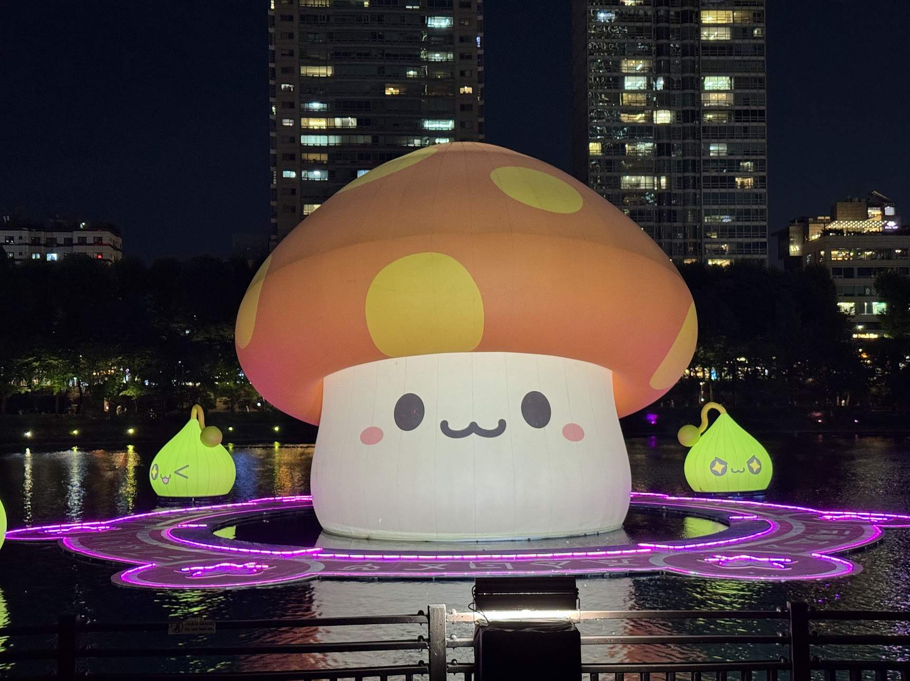
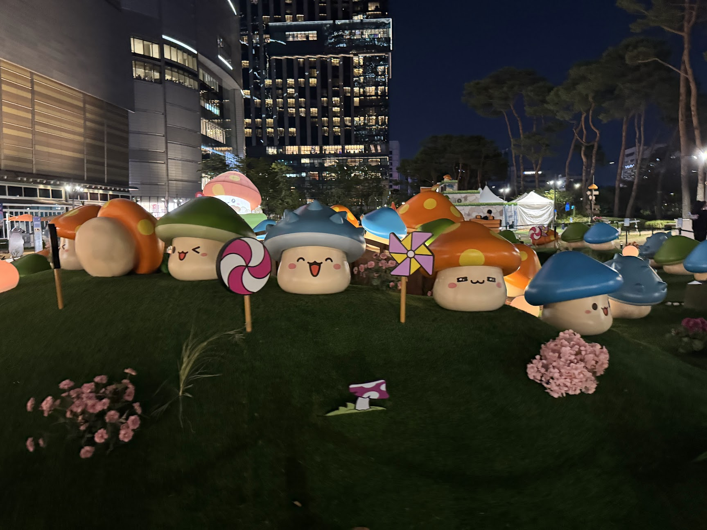
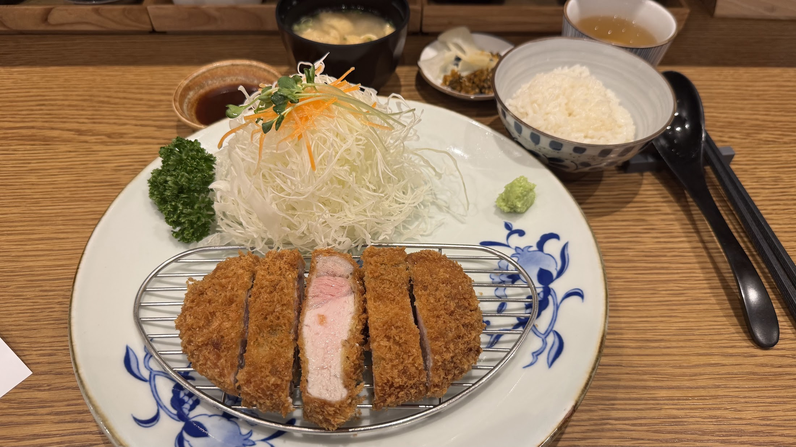
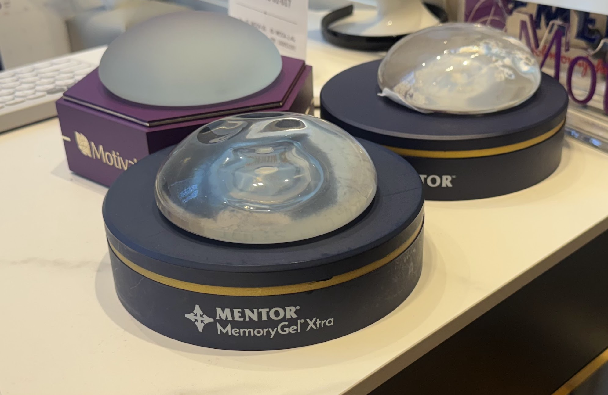
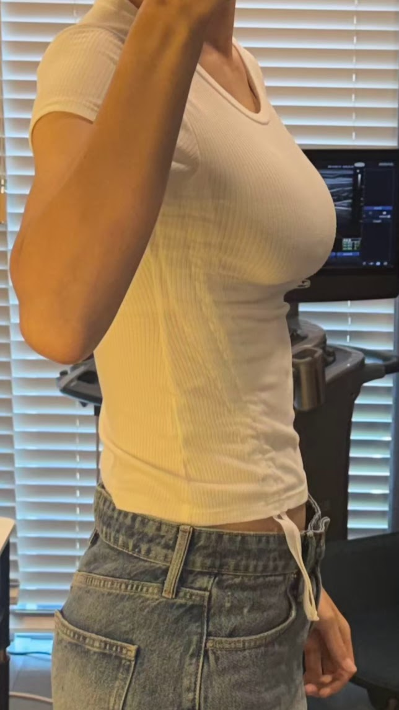
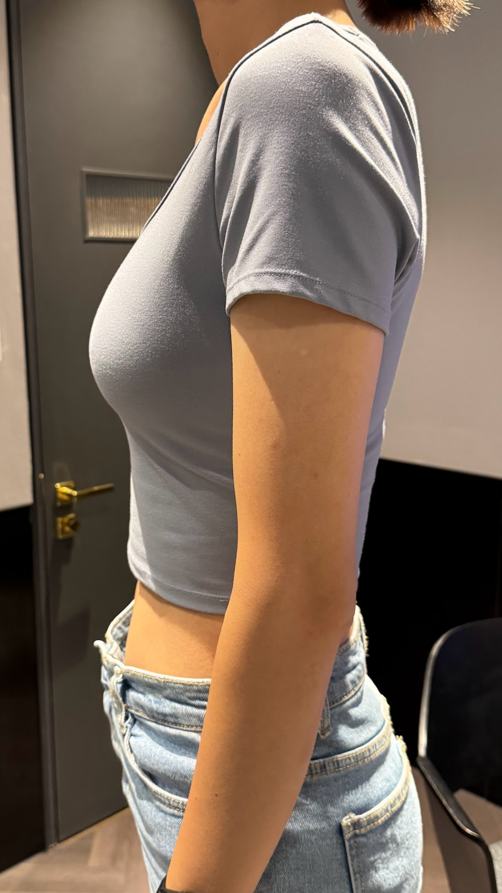
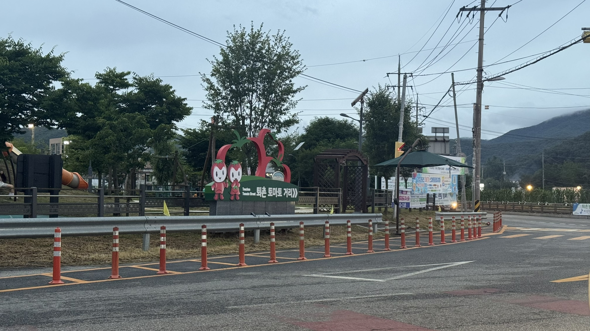

## 발레, 재밌는데 어려워.
6월 1주와 2주차에 1.5준비반 수업을 들었는데, 센터를 거의 따라가지 못했다.
바도 잘한건 아니다.
플릭플락(Flic flac) 이라는 바 중간에 턴을 하는 동작이 있었는데 거의 움직이지 못했다.
몸 방향도 앞 뒤만이 아니고 대각선까지 사용해서 머리가 정지됐다.
센터는 더욱 가관이었던게 순서도 길고 모르는 동작이 나와서 따라가기 힘들었다.
남들은 순서 다들 잘 따라가는 것 같은데 나만 못하는 느낌이었다.
그래서 선생님께 레벨 1.5 준비반 말고 레벨 1 수업으로 다시 돌아가겠다고 했다.
선생님은 욕심이 있으셔서 개인레슨으로 1.5 준비반으로 올라갈 수 있게 도와주겠다고 하셨다.
하지만 개인레슨은 비용이 조금 부담돼서 지속이 어렵다는게 아쉬웠다.
그래서 23일에 레벨 1 수업이 끝나고 개인레슨까지 두 탕으로 조금 난이도 높은 훈련을 진행했다.
글리사드, 줴떼, 아쌈블레 같은 스몰 점프부터 해서 앙디올 앙드당 턴을 집중적으로 훈련했다.

7월에 어떻게 될지 몰라서 추가등록은 안했다.
레벨 1과 1.5준비반 갭 차이가 심하다는 것도 하나의 요인이었다.
다른 학원을 경험해보고자 하는 생각도 있었다.
그리고 어떤 외모 정병에 빠져서 그에 대한 고민을 하느라 불확실성이 컸다.

## 메이플스토리 팝업
잠실 석촌호수에 주황버섯이 떠있다고 해서 다녀왔다.
저녁에 가서 사람은 별로 없고 먹지 못하는 버섯만 많았다.
(나는 버섯을 싫어한다.)
<figure>
    
    <figcaption>거대한 주황버섯. 2026.06.15</figcaption>
</figure>
<figure>
    
    <figcaption>식용이 아닌 버섯이라 귀여웠다. 2026.06.15</figcaption>
</figure>

잠실에 간 겸 저녁으로 돈카츠도 먹고 왔다.
롯데월드몰 5층에 새로 생긴 돈카츠 집인 것 같은데 분지로 라고 하는 곳이다.
일본 프랜차이즈로 한국으로 들어온 일식집이었다.
역시 일본의 돈카츠집 답게 양배추를 많이 주는게 좋았다.
돈카츠의 튀김은 고로케 튀김과 비슷했다.
<figure>
    
    <figcaption>분지로 돈카츠. 2026.06.15</figcaption>
</figure>

## 돌아온 외모 정병.

내가 생각하는 나의 외모에 대한 컴플렉스는 꽤 많긴 하다.
얼굴부터 시작해서 키, 목소리, 그리고 가슴 등등...
그 중에서 얼굴은 이미 어느 정도 해서 더 손대고 싶은 마음은 없다.
키는 줄일 수 있는 방법이 없고...
목소리는 결과가 랜덤이라는 점이 수술이 꺼려지게 만드는 요인이다.
그래서 그나마 효과적이라고 생각하는 가슴 수술에 관심을 갖게 됐다.
<figure>
    
    <figcaption>첫 병원에 상담가서 본 보형물들. 2026.06.19</figcaption>
</figure>

6월 후반부에는 가슴 성형 상담을 다녔다.
총 4곳을 다녔고 병원마다 특징이 달랐다.

| 병원 | A | B | C | D |
|:---: | :---: | :--: | :--: | :--: |
| **병원** | 중형, 가슴센터 | 개인, 가슴전문 (한 층) | 대형 (건물 전체), 가슴센터 | 중형, 가슴전문 (건물 전체) |
| **절개 부위** | 밑절 | 밑절 | 밑절 | 밑절 |
| **수술 방법** | 근막하 | 이중평면 | 근막하 + 가슴골 지방이식 | 근막하 |
| **가슴방** | 13.5cm | 14.5cm | 14.2cm | 13.5cm |
| **보형물** | 모티바 Full 425, 450, 500cc | 모티바 Demi 525cc | 모티바 Demi 360, 380cc | 모티바 Demi 380, 425, 475cc|
| **예상 사이즈** | Full B - C | Full C - D | B | Full B - C |

상담 받아볼수록 치수 재는 것도 병원마다 다르고, 보형물 사이즈도 다 달라서 고민이 된다.
그리고 무엇보다 병원 서비스 측면에서 다른 부분들이 있어서 나름대로 점수를 매겨봤다.

| **평가** | | | | |
|:---: | :---: | :--: | :--: | :--: |
| 병원 | A | B | C | D |
| **코멘트** | **예약금 유도 (-)** **사이즈 추천 soso** **입원 무료** | **상담 good** **사이즈 추천 good** **입원 유료 (-)** **이중평면 (-)** | **강요 없지만 비쌈.** **사이즈 만족 못할 가능성.** **리셉션 호텔느낌.** **A/S 1년 (-)** | **생각보다 쌈.** **사이즈 마음에 듦.** **가슴 전문 병원.** **수술 후 케어** **(물리치료, 필라테스)** |
| **상담** **(3점)** | 2.5 | 2.9 | 2.5 | 2.9 |
| **미감, 사이즈** **(4점)** | 3 | 3.7 | 3 | 3.9 |
| **병원 서비스** **(3점)** | 2.7 | 2.6 | 2.5 | 2.9 |
| **총 평가** **(10점)** | **8.2** | **9.2** | **8** | **9.7** |

A 병원과 D 병원에서 보형물을 바깥에 착용하고 시뮬레이션으로 찍은 사진들을 비교하면 다음과 같다.
<figure>
  

    
    
  

  <figcaption>왼쪽이 A 병원, 오른쪽이 D 병원 시뮬레이션. 2026.06</figcaption>
</figure>

왼쪽이 조금 더 크고 Full 타입이라 볼륨감 있어보이지만 너무 부해보여서 오른쪽이 더 나은 것 같다.
가슴이 없었다 보니까 갖고 싶은 가슴에 대한 기준이 없었다.
상담을 다니면서 점차 나에게 적절한 스타일을 찾을 수는 있었다.
하지만 수술이다보니까 고민은 계속됐다.
1. 굳이 해야할까? 돈이 많이 드는 수술이라...
2. 수술 후 부작용 걱정과 추후 보형물 교체에 대한 부담.
3. 좋아하는 운동이 발레랑 클라이밍인데 가슴을 많이 쓰는거라 제약이 생길까봐 고민.
4. 아직 내 정체성을 모르는 지인들을 만나기 어려워질 것 같음...
5. 없으면 없는대로 편한걸 못 누림.

하지만 했을 때의 만족감도 장난 아닐 것 같다.
어쨌든 이렇게 고민을 하고 있는 와중 SSAFY 결과가 나왔다.

불합격이었다.

사실 SSAFY 면접 준비도 안했고 한편으론 KIT 박사돼서 유학가면 되지 라는 생각이었다.
하지만 6월 30일 KIT 의 결과가 나왔고 이것도 불합격이었다.
이제 박사과정에 대한 모든 지원과 계획이 끝났다.
플랜 B로 세워둔 것도 하나도 성공하지 못했다.
그래서 새로운 길을 찾아야한다... 고민고민

사실 SK 하이닉스도 지원했었다.
6월에 갑자기 신입 공고가 떠서 지원했지만 서류 탈락했다. 하하
그래서 가슴 고민을 접어두게 되었다.
대신 삼성전자 페스타 하는 김에 갤럭시 S26을 구매했다.
강남으로 찾으러 갈 예정!

## 캠핑에 빠진 아빠.

아빠가 캠핑에 꽂혔다.
역시 한국인답게 장비병이 제대로 올라서 텐트도 사고 에어매트도 사고 짐이 점점 많아졌다.
나는 캠핑보다는 호텔에서 호캉스를 보내자는 주의라서 이해는 안되지만...

그래서 주말마다 아침에 일어나면 부모님이 집에 없었다.
한 번은 2박 3일로 캠핑하는 곳에 찾아갔다.
퇴촌 근처의 캠핑장이었다.
<figure>
    
    <figcaption>퇴촌 토마토 축제 기간이었다. 2026.06.20</figcaption>
</figure>

산을 한참 타고 올라간 것 같다.
이 날 비가 와서 캠핑장에 아무도 없었다.
나름 운치 있고 좋다고 생각했다.
<figure>
    
    <figcaption>부모님 텐트와 우리 집 차 총 집합. 2026.06.20</figcaption>
</figure>

<!-- | **상담비** | 없음. 가예약 (20만원, 환불 가능) | 1만원 | X | 1만원 | -->
<!-- | **속옷 지원** | 보정속옷 무상 대여 | 보정속옷, 스포츠브라 (6개월까지) | 보정속옷 | 보정속옷, 자체 제작 브라 | -->

<!-- | **수술 방법** | **근막하**  근육을 절개하지 않아 회복 후 근육 사용 편함, 애니메이션 현상 없음. | **이중평면**  피부가 얇고 가슴 볼륨이 없어서 이중평면 추천. 근막하로 하면 보형물이 그대로 보여서 부자연스러울 것. 운동을 3개월 간 쉬고 자제해야함. (클라이밍, 발레) | **근막하 + 가슴골 지방이식**  이중평면, 근막하 고민했는데 근육 만져보고 근막하 추천. 가슴골에 피부 얇고 자산 없어서 지방이식 필요. | **근막하**  평균 여성들보다 피부가 두꺼워서 근막하로 하는게 촉감이 좋을듯. 이중평면으로 하면 모양은 예쁠텐데 근육 때문에 단단하게 느껴질 것. | -->

<!-- | **총평** | • 근막하로 수술. 운동제약 덜 함. • 피부 얇아서 티 남. • 사이즈 선택에서 자유로움. • 가예약 압력 있었지만 수술비 생각보다 저렴. • 입원 가능 (무료) | • 피부 얇아서 이중평면 수술. 운동 제약. • 자연스러움 추구해서 모티바 데미. • 예약 압력 없고 원장 상담 비중 높음. • 수술 후 브라 제공. • 입원 가능 (15만원) | • 근육 움직임 때문에 근막하. • 자연스러움 추구해서 작은 사이즈에 지방이식까지. • 예약 강요 없지만 비쌈. • 수술 후 A/S 1년 (구형구축, 파열) • 당일 입퇴원 | • 촉감 생각하면 근막하 추천. • 자연스러움 추구, 데미로 크게 가능. • 가슴전문병원이고 생각보다 저렴. • 수술 후 케어 좋음. • 당일 입퇴원 | -->

<!-- | **상담 분위기** | 큰 사이즈 적극 추천, 좋은 가격 조건으로 가예약금 유도. 원장 상담 시간이 적고 빠른 느낌이 들음. 사이즈나 미감에 대한 판단을 안해줌. 자연스러움보다는 어짜피 티날거라 크게 하고 싶으면 해도 된다고 함. | 원장과 상담하는 시간이 대부분. 계속 질문 있냐고 물어보셔서 짜내듯 질문함. 보형물도 작은 것부터 큰 것까지 계속 넣어보면서 어울리는 모양을 찾음. 체격과 다양한 것을 고려해서 자연스러움을 추구. | 상담할 때 내 체형을 보고 좀 곤란해하는 느낌. 가슴에 살이 별로 없어서 사이즈도 제한되는 느낌이었고 지방이식까지 추천해서 수술 부담 커짐. | 최대한 니즈 파악하고 모양에 따라 보형물 사이즈 맞춰줌. 윗볼록 경계지니까 상담할 때 최소한 발생하지 않을 수 있는 범위를 알려줌. 다른 사례들도 비교해주면서 내가 어느 정도까지 가능한지 파악할 수 있게 도와줌. 발레한다고 해서 발레리나들 보통 B 정도 한다고 함. 흉터 치료. | -->
<!-- | **비용** | 1,210 만원 -> 당일 가예약 시 900만원 | 모티바 칩O 1485만원 -> 990만원 (후기, 리뷰) 모티바 칩X 1155만원 -> 950만원 (후기, 리뷰) 입원 시 15만원 추가. | 1250 -> 980 + 검사비 55 (후기, 사진) 당일 예약 검사 시 920 (검사비 포함) 지방이식 160 추가 | 1150 -> 900 (후기, 사진) 당일 예약 시 850 | -->